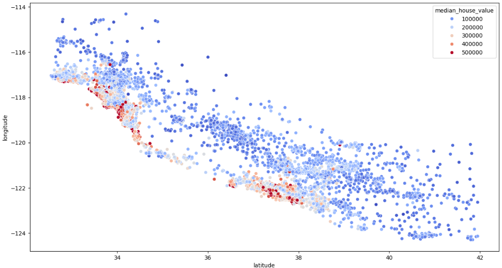

# Basic idea

predict the house prices using features like area , coordinates, rooms, income etc..

main goal: target variable = median house value

20641 houses in total

### workflow in the notebook:

- load libraries
- load data
- pre process
- encode string variables to 1s and 0s
- feature engineering
- apply the model

## Results

0.66 accuracy came with linear regression model

## Tech Stack:

jupyter notebook
working knowledge of ML FUNDAMENTALS

sk.learn
numpy
pandas

## In future

Accuracy can be imporved with random forest or more advance models definitely.
